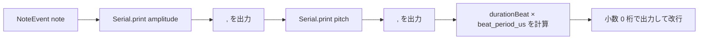

# `src/Receiver.hpp` フローチャート

アプリケーション側の受信処理です。`hack::Receiver` が完成したフレームをコールバックへ渡し、対象機器宛てのフレームから拍タイミングと BPM を更新します。その後、楽譜のノートを拍位置に合わせて CSV 出力します。

## 初期化

```mermaid
flowchart TD
    A([receiver::setup]) --> B[Serial.begin 250000]
    B --> C["Receiver" をシリアル出力]
    C --> D[receiver.begin(onPacketReceived)]
    D --> E[受信状態を Idle に初期化<br/>サンプル窓を reset<br/>コールバックを登録]
    E --> F([初期化完了])
```

## メインループとノート出力

```mermaid
flowchart TD
    A([receiver::loop]) --> B[receiver.update]
    B --> C{note_index < sheet_music.size()?}
    C -- いいえ --> D([loop 終了])
    C -- はい --> E{beat_period_us == 0?}
    E -- はい --> D
    E -- いいえ --> F[note = sheet_music[note_index]]
    F --> G[beatOffset = note.startBeat - beat_count]
    G --> H{1.0 < beatOffset?}
    H -- はい --> D
    H -- いいえ --> I{beatOffset < 0?}
    I -- はい --> J[note_index++<br/>過去のノートをスキップ]
    J --> C
    I -- いいえ --> K[beatProgress = (micros - beat_timing_us)<br/>/ beat_period_us]
    K --> L{beatOffset <= beatProgress?}
    L -- いいえ --> D
    L -- はい --> M[emitNoteCsv(note)]
    M --> N[note_index++]
    N --> C
```

## 受信フレームの処理

`hack::Receiver` が 2 バイトのフレームを完成させると `onPacketReceived()` が呼ばれます。まず宛先ビットを検査し、対象外のフレームは無視します。対象フレームの BPM が 0 の場合は再生状態をリセットします。

```mermaid
flowchart TD
    A([onPacketReceived(data)]) --> B[frame[0] の machine_id_bit を読む]
    B --> C{対象機器宛て?}
    C -- いいえ --> D([何も変更せず終了])
    C -- はい --> E{data[1] == 0?}
    E -- はい --> F[beat_timing_us = 0]
    F --> G[beat_period_us = 0]
    G --> H[beat_count = 0]
    H --> I[note_index = 0]
    I --> J([リセット終了])
    E -- いいえ --> K[beat_timing_us = micros]
    K --> L[beat_period_us = app::period(data[1])]
    L --> M[beat_count++]
    M --> N([通常拍の更新終了])
```

## ノートの CSV 出力

ノートは `振幅,音程,長さ[マイクロ秒]` の順で 1 行出力されます。長さはノートの拍数に現在の拍周期を掛けて計算します。



## ノート位置の判定

- `beatOffset > 1.0` のとき、対象ノートはまだ処理時刻より先なので次の受信更新を待ちます。
- `beatOffset < 0.0` のとき、ノートはすでに過ぎているため、出力せず次のノートへ進みます。
- それ以外では、現在拍の開始からの経過拍数 `beatProgress` と比較します。
- `beatOffset <= beatProgress` になった時点で CSV を出力します。
