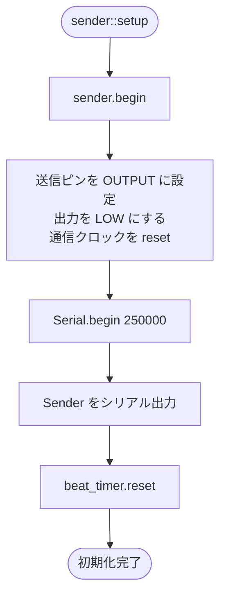

# `src/Sender.hpp` フローチャート

アプリケーション側の送信処理です。アナログ入力から BPM を推定し、拍ごとに 2 バイトのフレームを生成して、`hack::Sender` に送信を依頼します。

## 初期化



## メインループ

`loop()` は通信波形の更新、アナログ値の蓄積、拍周期の更新を毎回実行します。ただし、タイマーが次の拍に到達していない間は、フレーム生成処理を行わずに戻ります。

```mermaid
flowchart TD
    A([sender::loop]) --> B[sender.update]
    B --> C[analogRead(receiver_pin)]
    C --> D[now = micros]
    D --> E[bpm_window.push(now, value)]
    E --> F[periodUs = app::period(bpm)]
    F --> G{beat_timer.update(periodUs)?}
    G -- いいえ --> H([loop 終了])
    G -- はい --> I{isBoot?}
    I -- いいえ --> J[isBoot = true]
    J --> K[frame[0] = 255<br/>frame[1] = 0]
    K --> L[sender(frame)]
    L --> H
    I -- はい --> M[updateBpmFromAnalog]
    M --> N[frame[0] = 0]
    N --> O[beat_count に応じて<br/>frame[0] のビットを設定]
    O --> P[frame[1] = bpm]
    P --> Q{sender(frame) が成功?}
    Q -- はい --> R[beat_count を 1 増やす]
    Q -- いいえ --> S[beat_count は変更しない]
    R --> H
    S --> H
```

## BPM 更新

アナログ入力の直近区間を平均し、平均値を 4 で割ったものを BPM 候補にします。候補は 50 から 200 の範囲にクランプされます。十分なサンプルがない場合は BPM を変更しません。

```mermaid
flowchart TD
    A([updateBpmFromAnalog]) --> B[now = micros]
    B --> C[bit_us 前から now までの<br/>bpm_window.average を取得]
    C --> D{平均値が存在する?}
    D -- いいえ --> E([変更せず終了])
    D -- はい --> F[候補 = average / 4]
    F --> G[bpm = clamp(候補, 50, 200)]
    G --> H([終了])
```

## フレーム生成

`frame` は 2 バイトです。`frame[0]` は宛先ビット群、`frame[1]` は BPM を表します。`beat_count / 8` 未満のビットだけを立てるため、拍数に応じて宛先情報が段階的に追加されます。

```mermaid
flowchart TD
    A[frame[0] = 0] --> B[i = 0]
    B --> C{i < 8?}
    C -- いいえ --> D[frame[1] = bpm]
    C -- はい --> E{i < beat_count / 8?}
    E -- はい --> F[writeBit(frame[0], i, true)]
    E -- いいえ --> G[ビットを変更しない]
    F --> H[i++]
    G --> H
    H --> C
    D --> I([2バイトフレーム完成])
```

## 起動直後と通常拍の違い

- 起動直後の最初の拍では `255, 0` を送信します。これは宛先ビットをすべて立てた初期化用フレームです。
- 2 回目以降はアナログ値から BPM を更新し、宛先ビット群と BPM を含むフレームを送信します。
- `hack::Sender` が送信中なら `sender(frame)` は `false` を返すため、その拍では `beat_count` を進めません。
