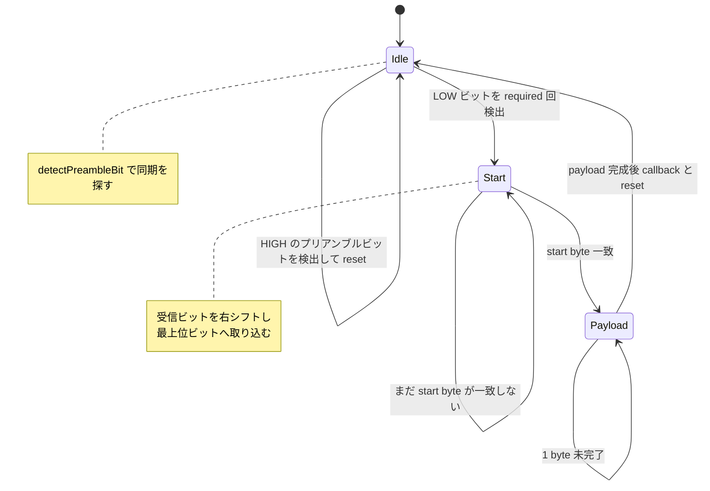
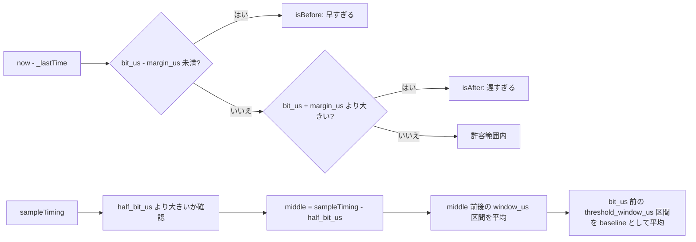

# `src/hack/Receiver.hpp` フローチャート

`hack::Receiver` はアナログ入力をサンプリングし、移動窓の平均値からビット波形を復元する受信状態機械です。プリアンブル、開始バイト、固定長 payload の順に検出し、payload 全体が揃ったときだけコールバックを呼び出します。

## 状態遷移



## 初期化と毎回の更新

```mermaid
flowchart TD
    A([begin(callback)]) --> B{callback が存在する?}
    B -- はい --> C[_callback = callback]
    B -- いいえ --> D[_callback = noCallback]
    C --> E[_prefixSumWindow.reset]
    D --> E
    E --> F[resetState]
    F --> G([Idle で待機])

    H([update]) --> I[analogRead(PIN)]
    I --> J[now = micros]
    J --> K[_prefixSumWindow.push(now, value)]
    K --> L{Mode}
    L -- Idle --> M[updateIdle(now)]
    L -- Start --> N[updateStart(now)]
    L -- Payload --> O[updatePayload(now)]
```

## Idle: プリアンブルの検出

プリアンブルは `0x00000000` の半分に相当する回数の LOW ビットを連続検出して同期します。HIGH を検出した場合は同期候補を破棄して最初からやり直します。

```mermaid
flowchart TD
    A([updateIdle(now)]) --> B[detectPreambleBit(now)]
    B --> C{ビットを取得できた?}
    C -- いいえ --> D([Idle 継続])
    C -- はい --> E{検出ビットが HIGH?}
    E -- はい --> F[resetState]
    F --> D
    E -- いいえ --> G[_bitIndex++]
    G --> H{_bitIndex == preamble_required?}
    H -- いいえ --> D
    H -- はい --> I[enterMode(Start)]
```

## Start: 開始バイトの照合

受信したビットを `_data` に取り込み、`Config::start` と一致するまで待ちます。一致したら payload の先頭へ進みます。

```mermaid
flowchart TD
    A([updateStart(now)]) --> B[receiveBit(now)]
    B --> C{ビットを取得できた?}
    C -- いいえ --> D([Start 継続])
    C -- はい --> E[shiftInBit(_data, bit)]
    E --> F{_data == Config::start?}
    F -- いいえ --> D
    F -- はい --> G[enterMode(Payload)]
```

## Payload: 固定長フレームの組み立て

1 バイトの 8 ビットを受信するたびに `_buffer[_packetSize]` へ保存します。`Capacity` バイトすべてが揃った時点で callback を呼び、その後に受信状態を初期化します。

```mermaid
flowchart TD
    A([updatePayload(now)]) --> B[receiveBit(now)]
    B --> C{ビットを取得できた?}
    C -- いいえ --> D([Payload 継続])
    C -- はい --> E[writeBit(_data, _bitIndex, bit)]
    E --> F[_bitIndex++]
    F --> G{1 byte 完了?}
    G -- いいえ --> D
    G -- はい --> H[_buffer[_packetSize] = _data]
    H --> I[_data = 0<br/>_bitIndex = 0]
    I --> J[_packetSize++]
    J --> K{Capacity byte 完了?}
    K -- いいえ --> D
    K -- はい --> L[_callback(_buffer)]
    L --> M[resetState]
    M --> N([Idle に戻る])
```

## ビットの受信タイミング

`receiveBit()` は前回のビット時刻 `_lastTime` との差を判定します。早すぎるサンプルは無視し、許容範囲内なら現在時刻を基準に `decode()` します。遅すぎる場合は予定時刻の窓を直接読み、窓がなければ受信全体をリセットします。

```mermaid
flowchart TD
    A([receiveBit(now)]) --> B{isBefore(now)?}
    B -- はい --> C[nullopt を返す]
    B -- いいえ --> D{isAfter(now)?}
    D -- いいえ --> E[decode(now)]
    E --> F([結果を返す])
    D -- はい --> G[readWindow(_lastTime + bit_us)]
    G --> H{窓を取得できた?}
    H -- いいえ --> I[resetState]
    I --> J[nullopt を返す]
    H -- はい --> K[_lastTime += bit_us]
    K --> L[second < first でビット判定]
    L --> M([結果を返す])
```

## サンプル値からビットへの復号

`decode()` はサンプル時刻の前後の短い窓を平均し、直前の基準値と比較します。2 つの窓が同じレベルなら波形の変化がないため無効とし、異なる場合だけビットを確定します。

```mermaid
flowchart TD
    A([decode(sampleTiming)]) --> B[readWindow(sampleTiming)]
    B --> C{前後の平均窓がある?}
    C -- いいえ --> D[nullopt]
    C -- はい --> E[readBaseline(sampleTiming)]
    E --> F{基準値がある?}
    F -- いいえ --> D
    F -- はい --> G[前窓と後窓を baseline と比較]
    G --> H{2つのレベルが同じ?}
    H -- はい --> D
    H -- いいえ --> I[_lastTime = sampleTiming]
    I --> J[前窓のレベルをビットとして返す]
```

## 時刻判定と窓の制約



## リセット条件

- `begin()` 呼び出し時にサンプル窓と状態を初期化します。
- Idle で HIGH のプリアンブルビットを検出したとき、同期候補を破棄します。
- プリアンブル待ち中に時刻が進みすぎたとき、同期を失ったとしてリセットします。
- Start / Payload の受信で必要なサンプル窓を取得できないとき、受信全体を Idle に戻します。
- payload が `Capacity` バイト揃った後、コールバック実行後に Idle へ戻ります。
