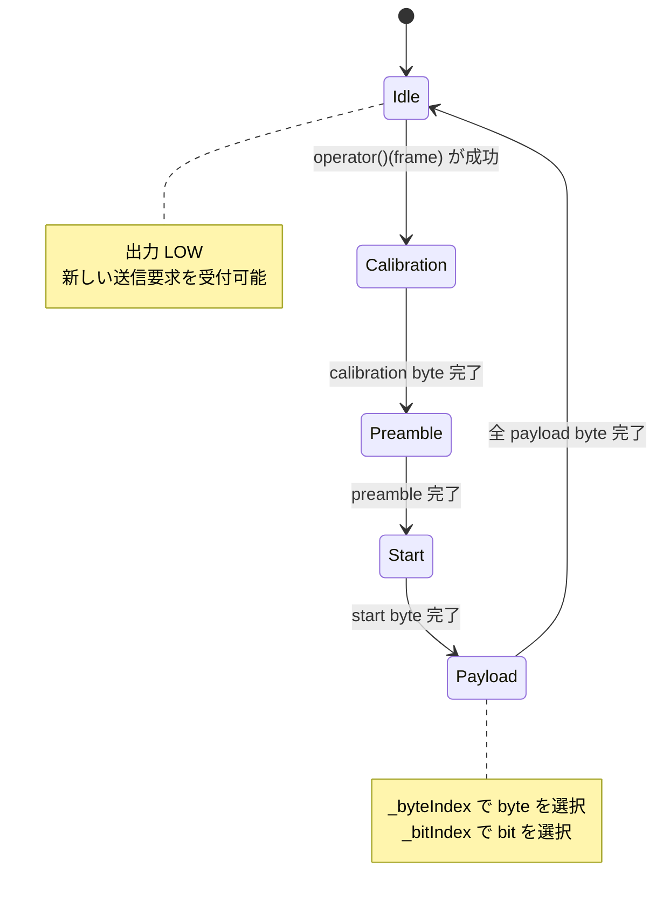

# `src/hack/Sender.hpp` フローチャート

`hack::Sender` は、要求されたバイト列を一定周期のビット波形へ変換する送信状態機械です。1 ビットを 2 つの半ビット区間に分け、後半の値を反転する差動的な波形として出力します。

## 状態とデータ



## 初期化

```mermaid
flowchart TD
    A([begin]) --> B[pinMode(PIN, OUTPUT)]
    B --> C[digitalWrite(PIN, LOW)]
    C --> D[_clock.reset]
    D --> E([Idle で待機])
```

## 送信要求の受付

送信中は新しいデータを受け付けません。受け付けに成功した時点でバッファと各インデックスを初期化し、次の `update()` から校正パターンを出力します。

```mermaid
flowchart TD
    A([operator()(x)]) --> B{_mode == Idle?}
    B -- いいえ --> C[false を返す<br/>要求を破棄]
    B -- はい --> D[_mode = Calibration]
    D --> E[_buffer = x]
    E --> F[_byteIndex = 0<br/>_halfPhase = false<br/>_bitIndex = 0]
    F --> G[true を返す]
```

## `update()` のディスパッチ

```mermaid
flowchart TD
    A([update]) --> B{_clock.update()?}
    B -- いいえ --> C([何もしないで終了])
    B -- はい --> D{現在の Mode}
    D -- Idle --> E[updateIdle]
    D -- Calibration --> F[updateCalibration]
    D -- Preamble --> G[updatePreamble]
    D -- Start --> H[updateStart]
    D -- Payload --> I[updatePayload]
    E --> J([終了])
    F --> J
    G --> J
    H --> J
    I --> J
```

## 制御部と payload の送信

```mermaid
flowchart TD
    A[updateCalibration] --> B[send(Config::calibration)]
    B --> C{1 byte 完了?}
    C -- いいえ --> D([Calibration 継続])
    C -- はい --> E[Mode = Preamble]

    F[updatePreamble] --> G[send(Config::preamble)]
    G --> H{4 byte 完了?}
    H -- いいえ --> I([Preamble 継続])
    H -- はい --> J[Mode = Start]

    K[updateStart] --> L[send(Config::start)]
    L --> M{1 byte 完了?}
    M -- いいえ --> N([Start 継続])
    M -- はい --> O[Mode = Payload]

    P[updatePayload] --> Q[send(_buffer[_byteIndex])]
    Q --> R{byte 完了?}
    R -- いいえ --> S([Payload 継続])
    R -- はい --> T[_byteIndex++]
    T --> U{全 byte 完了?}
    U -- いいえ --> P
    U -- はい --> V[Mode = Idle<br/>各インデックスを 0 に戻す]
```

## 1 バイトの波形生成

`send(data)` は呼び出しごとに現在のビットを出力します。同じビットを半ビット周期ごとに処理し、2 回目の処理で次のビットへ進みます。`_halfPhase` が `true` のときだけビット番号を進めるため、1 ビットは必ず 2 回の出力更新で完了します。

```mermaid
flowchart TD
    A([send(data)]) --> B[bit = readBit(data, _bitIndex)<br/>XOR _halfPhase]
    B --> C[digitalWrite(PIN, bit ? HIGH : LOW)]
    C --> D[_halfPhase を反転]
    D --> E{_halfPhase が true?}
    E -- いいえ --> F[false を返す<br/>半ビット目の処理]
    E -- はい --> G{_bitIndex++ == bit_size(data)?}
    G -- いいえ --> H[false を返す<br/>次の半ビットを待つ]
    G -- はい --> I[_bitIndex = 0]
    I --> J[true を返す<br/>バイト完了]
```

### 波形のポイント

- `Clock<half_bit_us>` により、およそ `200 us` ごとに出力更新を行います。
- `readBit(data, index) ^ _halfPhase` によって、同じ論理ビットでも半ビットごとに出力を反転します。
- 送信順序は `calibration (0x55)`、`preamble (0x00000000)`、`start (0b11000101)`、payload です。
- payload の最後まで送ると `Idle` に戻り、次の送信要求を受け付けられるようになります。
